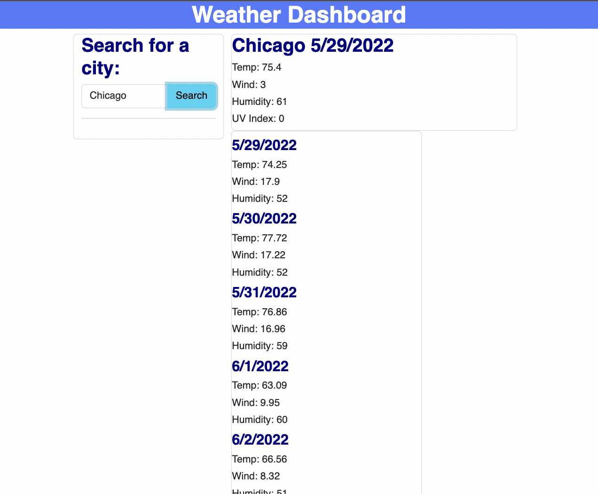

# Weather Application

## Description
For this weeks homework, I designed a weather application. 
When I enter the name of a city, it displays said citys temperature, wind speeds, humidity levels, and uv index. Beneath that, it displays a 5 day forecast displaying weather conditions for the week ahead. 

## Screenshot

## Link
repo:
https://github.com/brudter/weather-project
page:
https://brudter.github.io/weather-project/
